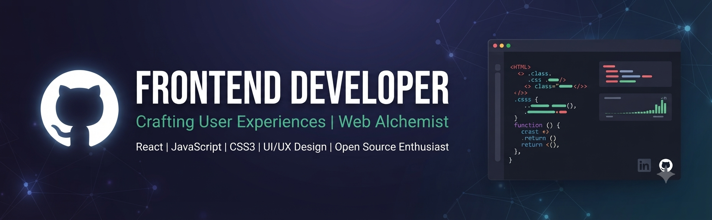

<div align="center">

  <!-- Direct Link to Uploaded Image File -->
  

  <br/><br/>

  <!-- Aapki Custom Typing SVG Image -->
  <p align="center">
    <a href="https://readme-typing-svg.demolab.com">
      
    </a>
  </p>

  <br/>

  <p align="center">
    <a href="mailto:noorahmad7316125@gmail.com">
      
    </a>
    
    
  </p>

</div>

<br/>

---

### 🗿 About Me

```typescript
type Developer = {
  name: string;
  role: string;
  coreStack: string[];
  education: string;
  speed: string;
  philosophy: string;
};

const NoorAhmad: Developer = {
  name: "Noor Ahmad",
  role: "Frontend Developer & Office Management Expert",
  coreStack: ["HTML5", "CSS3", "JavaScript", "Bootstrap", "Python"],
  education: "DAE - Computer Information Technology (SBTE)",
  speed: "Professional Touch Typist ⚡",
  philosophy: "Build in silence. Let the architecture speak."
};
